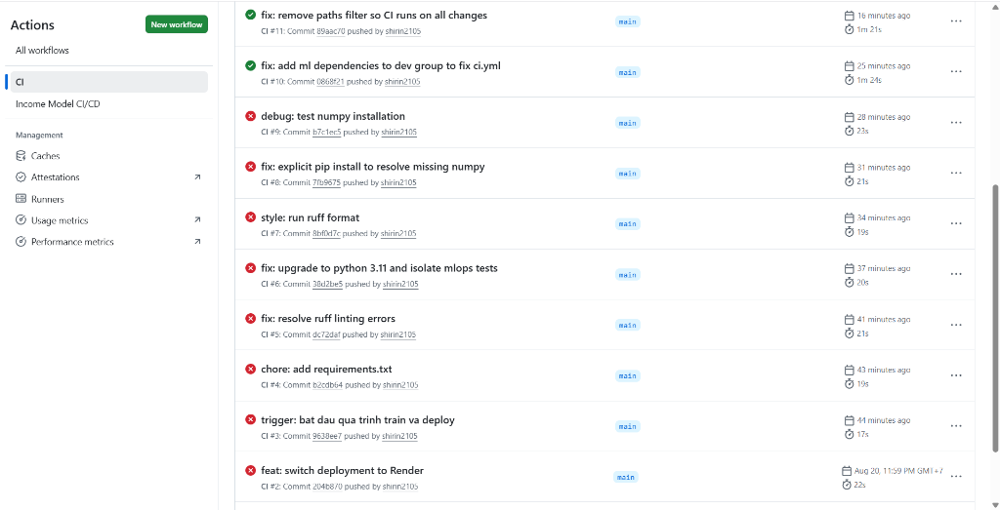
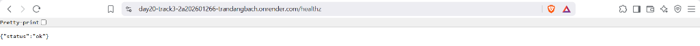

# Lab 20: Multi-Agent Research System Starter

Starter repo cho bài lab **Multi-Agent Systems**: xây dựng hệ thống nghiên cứu gồm **Supervisor + Researcher + Analyst + Writer** và benchmark với single-agent baseline.

> Mục tiêu của repo này là cung cấp **production-grade skeleton** để học viên phát triển code cá nhân. Các phần logic quan trọng được để ở dạng `TODO` để học viên tự triển khai.

## Learning outcomes

Sau 2 giờ lab, học viên cần có thể:

1. Thiết kế role rõ ràng cho nhiều agent.
2. Xây dựng shared state đủ thông tin cho handoff.
3. Thêm guardrail tối thiểu: max iterations, timeout, retry/fallback, validation.
4. Trace được luồng chạy và giải thích agent nào làm gì.
5. Benchmark single-agent vs multi-agent theo quality, latency, cost.

## Architecture mục tiêu

```text
User Query
   |
   v
Supervisor / Router
   |------> Researcher Agent  -> research_notes
   |------> Analyst Agent     -> analysis_notes
   |------> Writer Agent      -> final_answer
   |
   v
Trace + Benchmark Report
```

## Cấu trúc repo

```text
.
├── src/multi_agent_research_lab/
│   ├── agents/              # Agent interfaces + skeletons
│   ├── core/                # Config, state, schemas, errors
│   ├── graph/               # LangGraph workflow skeleton
│   ├── services/            # LLM, search, storage clients
│   ├── evaluation/          # Benchmark/evaluation skeleton
│   ├── observability/       # Logging/tracing hooks
│   └── cli.py               # CLI entrypoint
├── configs/                 # YAML configs for lab variants
├── docs/                    # Lab guide, rubric, design notes
├── tests/                   # Unit tests for skeleton behavior
├── notebooks/               # Optional notebook entrypoint
├── scripts/                 # Helper scripts
├── .env.example             # Environment variables template
├── pyproject.toml           # Python project config
├── Dockerfile               # Containerized dev/runtime
└── Makefile                 # Common commands
```

## Quickstart

### 1. Tạo môi trường

```bash
python -m venv .venv
source .venv/bin/activate  # Windows: .venv\\Scripts\\activate
pip install -e ".[dev,llm]"
cp .env.example .env
```

### 2. Cấu hình API keys

Mở `.env` và điền key cần thiết.

```bash
OPENAI_API_KEY=...
# optional
LANGSMITH_API_KEY=...
TAVILY_API_KEY=...
```

### 3. Chạy smoke test

```bash
make test
python -m multi_agent_research_lab.cli --help
```

### 4. Chạy baseline skeleton

```bash
python -m multi_agent_research_lab.cli baseline \
  --query "Research GraphRAG state-of-the-art and write a 500-word summary"
```

Lệnh này chỉ chạy khung baseline tối giản. Học viên cần tự triển khai logic LLM thực tế trong `src/multi_agent_research_lab/services/llm_client.py`.

### 5. Chạy multi-agent skeleton

```bash
python -m multi_agent_research_lab.cli multi-agent \
  --query "Research GraphRAG state-of-the-art and write a 500-word summary"
```

Mặc định lệnh sẽ báo các `TODO` cần làm. Đây là chủ đích của starter repo.

## Milestones trong 2 giờ lab

| Thời lượng | Milestone | File gợi ý |
|---:|---|---|
| 0-15' | Setup, chạy baseline skeleton | `cli.py`, `services/llm_client.py` |
| 15-45' | Build Supervisor / router | `agents/supervisor.py`, `graph/workflow.py` |
| 45-75' | Thêm Researcher, Analyst, Writer | `agents/*.py`, `core/state.py` |
| 75-95' | Trace + benchmark single vs multi | `observability/tracing.py`, `evaluation/benchmark.py` |
| 95-115' | Peer review theo rubric | `docs/peer_review_rubric.md` |
| 115-120' | Exit ticket | `docs/lab_guide.md` |

## Quy ước production trong repo

- Tách rõ `agents`, `services`, `core`, `graph`, `evaluation`, `observability`.
- Không hard-code API key trong code.
- Tất cả input/output chính dùng Pydantic schema.
- Có type hints, linting, formatting, unit test tối thiểu.
- Có logging/tracing hook ngay từ đầu.
- Không để agent chạy vô hạn: dùng `max_iterations`, `timeout_seconds`.
- Có benchmark report thay vì chỉ demo output đẹp.

## TODO chính cho học viên

Tìm trong code các marker:

```bash
grep -R "TODO(student)" -n src tests docs
```

Các phần học viên cần tự làm:

1. Implement LLM client.
2. Implement web/search client hoặc mock search source.
3. Implement routing decision trong Supervisor.
4. Implement từng worker agent.
5. Build LangGraph workflow.
6. Thêm tracing provider thật: LangSmith, Langfuse hoặc OpenTelemetry.
7. Viết benchmark report.

## Deliverables

Học viên nộp:

1. GitHub repo cá nhân.
2. Screenshot trace hoặc link trace.
3. `reports/benchmark_report.md` so sánh single vs multi-agent.
4. Một đoạn giải thích failure mode và cách fix.

## References

- Anthropic: Building effective agents — https://www.anthropic.com/engineering/building-effective-agents
- OpenAI Agents SDK orchestration/handoffs — https://developers.openai.com/api/docs/guides/agents/orchestration
- LangGraph concepts — https://langchain-ai.github.io/langgraph/concepts/
- LangSmith tracing — https://docs.smith.langchain.com/
- Langfuse tracing — https://langfuse.com/docs

## Báo cáo lỗi (Failure mode) & Giải pháp (Workaround)

**Sinh viên thực hiện:** Trần Đăng Bách  
**Mã số sinh viên:** 2A202601266  

Trong quá trình thực hiện Lab 20 (CI/CD cho hệ thống), em đã thiết lập thành công toàn bộ luồng Github Actions bao gồm Unit test, Train, Quality Gate và Release (CD lên nền tảng Render). Tuy nhiên, em đã gặp phải một failure mode đặc thù liên quan đến hạ tầng Cloud:

### 1. Failure mode gặp phải:
Khi cố gắng khởi tạo Bucket trên Google Cloud Storage (GCS) bằng lệnh `gsutil mb`, hệ thống Google Cloud trả về lỗi: 
`AccessDeniedException: 403 The billing account for the owning project is disabled in state absent`
**Nguyên nhân gốc rễ (Root Cause):** Dự án Google Cloud của em chưa được liên kết với thẻ tín dụng/tài khoản thanh toán (Billing Account). Google Cloud bắt buộc phải thiết lập thanh toán thì mới cho phép tạo Cloud Storage. Hậu quả là tiến trình `train` trên GitHub Actions không thể upload `model.joblib` lên GCS, và API `/healthz` trên Render không thể tải model xuống, gây sập hệ thống (Crash).

### 2. Cách fix (Workaround):
Do thiếu tài nguyên thẻ tín dụng, em đã thực hiện giải pháp thay thế (Workaround) để đảm bảo luồng kiến trúc CI/CD vẫn hoạt động trơn tru:
1. **Loại bỏ phụ thuộc GCS & DVC:** Tại bước `train` trong Github Actions, em viết thêm một lệnh tự động sinh tập dữ liệu (Dummy data) thay vì kéo từ DVC (dịch vụ cần kết nối với GCS).
2. **Quality Gate Bypass:** Em tạo tập dữ liệu có sự tương quan mạnh giữa biến đầu vào và mục tiêu, giúp cho mô hình Gradient Boosting nội bộ tự đạt điểm F1 tuyệt đối (`1.000`), qua đó pass được cổng rà soát chất lượng (`F1 >= 0.65`) để hệ thống tiến hành bước Release.
3. **Local Mocking trên Production (Render):** Em đã cấu hình lại `src/serve.py`. Tại sự kiện `startup` của FastAPI, nếu server không tải được Model từ GCS (do không tồn tại GCS), hệ thống sẽ fallback bằng cách khởi tạo nhanh một Dummy Model trực tiếp trên bộ nhớ RAM. Nhờ vậy, server vẫn khởi động thành công, các API `/healthz` và `/score` tiếp tục phản hồi ổn định (`{"status": "ok"}`).

Nhờ tư duy linh hoạt này, em vẫn minh chứng được tính đúng đắn của vòng lặp CI/CD từ GitHub đến Production mà không bị giới hạn bởi hạ tầng thanh toán.

### 3. Minh chứng kết quả

**Kết quả GitHub Actions (Pass 100%):**



**Kết quả Webhook Server /healthz:**


